2017年围棋界发生了一件比较重要事，Master（Alphago）以60连胜横扫天下，击败各路世界冠军，人工智能以气势如虹的姿态出现在我们人类的面前。围棋曾经一度被称为“人类智慧的堡垒”，如今，这座堡垒也随之成为过去。从2016年三月份AlphaGo击败李世石开始，AI全面进入我们大众的视野，对于它的讨论变得更为火热起来，整个业界普遍认为，它很可能带来下一次科技革命，并且，在未来可预见的10多年里，深刻地改变我们的生活。

<!--more-->

其实，AI除了可以做我们熟知的人脸、语音等识别之外，它可以做蛮多有趣的事情。

例如，让AI学习大量古诗之后写古诗，并且可以写出质量非常不错的古诗。

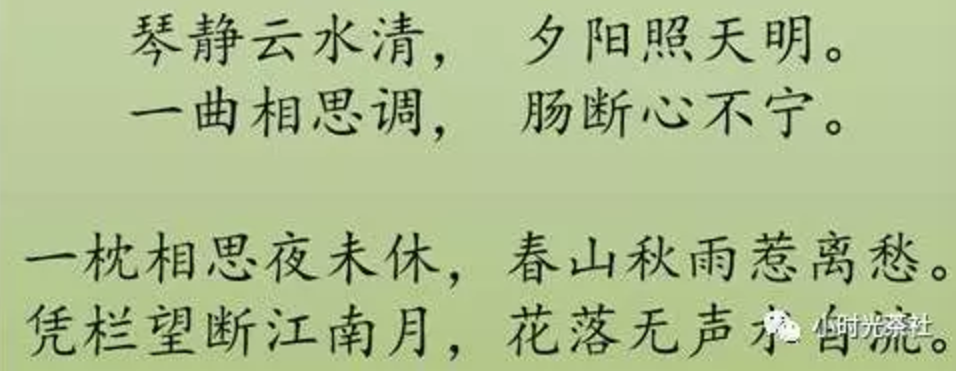

又或者，将两部设计造型不同的汽车进行融合，形成全新一种设计风格的新汽车造型。

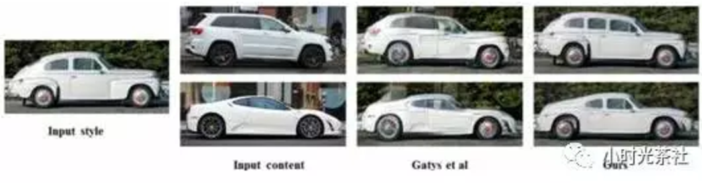

还有，之前大家在朋友圈里可能看过的，将相片转换成对应的艺术风格的画作。


当前，人工智能已经在图像、语音等多个领域的技术上，取得了全面的突破。与此同时，另外一个问题随之而来，如果这一轮的AI浪潮真的将会掀起新的科技革命，那么在可预见的未来，我们整个互联网都将发生翻天覆地的变化，深刻影响我们的生活。那么作为普通业务开发工程师的我，又应该以何种态度和方式应对这场时代洪流的冲击呢？

在回答这个问题之前，我们先一起看看上一轮由计算机信息技术引领的科技革命中，过去30多年中国程序员的角色变化：

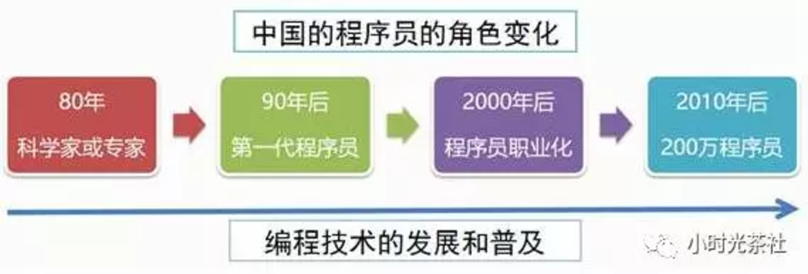

通过上图可以简总结：编程技术在不断地发展并且走向普及，从最开始掌握在科学家和专家学者手中的技能，逐渐发展为一门大众技能。换而言之，我们公司内很多资深的工程师，如果带着今天对编程和计算机的理解和理念回到1980年，那么他无疑就是那个时代的计算机专家。

如果这一轮AI浪潮真的会带来新的一轮科技革命，那么我们相信，它也会遵循类似的发展轨迹，逐步发展和走向普及。如果基于这个理解，或许，我们可以通过积极学习，争取成为第一代AI工程师。

## 二、深度学习技术

这一轮AI的技术突破，主要源于深度学习技术，而关于AI和深度学习的发展历史我们这里不重复讲述，可自行查阅。我用了一个多月的业务时间，去了解和学习了深度学习技术，在这里，我尝试以一名业务开发工程师的视角，以尽量容易让大家理解的方式一起探讨下深度学习的原理，尽管，受限于我个人的技术水平和掌握程度，未必完全准确。

### 1. 人的智能和神经元

人类智能最重要的部分是大脑，大脑虽然复杂，它的组成单元却是相对简单的，大脑皮层以及整个神经系统，是由神经元细胞组成的。而一个神经元细胞，由树突和轴突组成，它们分别代表输入和输出。连在细胞膜上的分叉结构叫树突，是输入，那根长长的“尾巴”叫轴突，是输出。神经元输出的有电信号和化学信号，最主要的是沿着轴突细胞膜表面传播的一个电脉冲。忽略掉各种细节，神经元，就是一个积累了足够的输入，就产生一次输出（兴奋）的相对简单的装置。

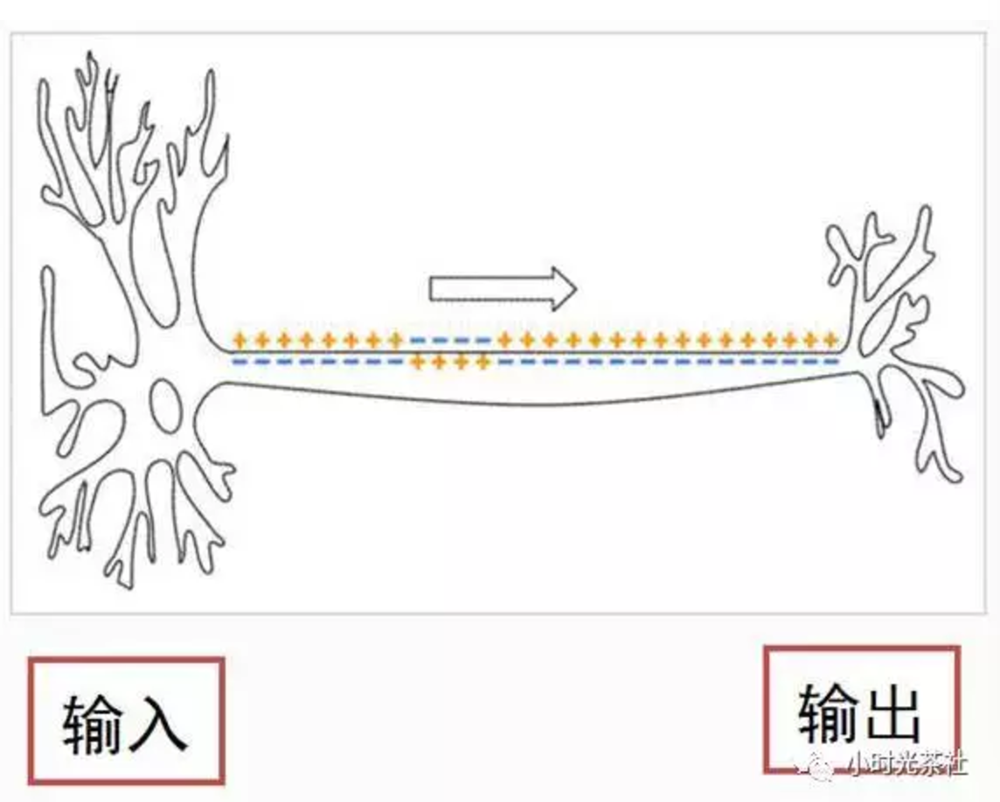

树突和轴突都有大量的分支，轴突的末端通常连接到其他细胞的树突上，连接点上是一个叫“突触”的结构。一个神经元的输出通过突触传递给成千上万个下游的神经元，神经元可以调整突触的结合强度，并且，有的突触是促进下游细胞的兴奋，有的是则是抑制。一个神经元有成千上万个上游神经元，积累它们的输入，产生输出。

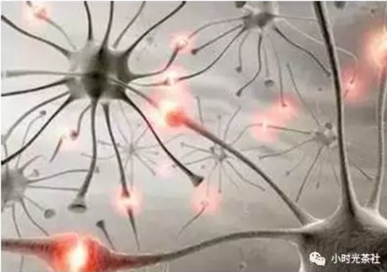

人脑有1000亿个神经元，1000万亿个突触，它们组成人脑中庞大的神经网络，最终产生的结果即是人的智能。

### 2. 人工神经元和神经网络

一个神经元的结构相对来说是比较简单的，于是，科学家们就思考，我们的AI是否可以从中获得借鉴？神经元接受激励，输出一个响应的方式，同计算机中的输入输出非常类似，看起来简直就是量身定做的，刚好可以用一个函数来模拟。

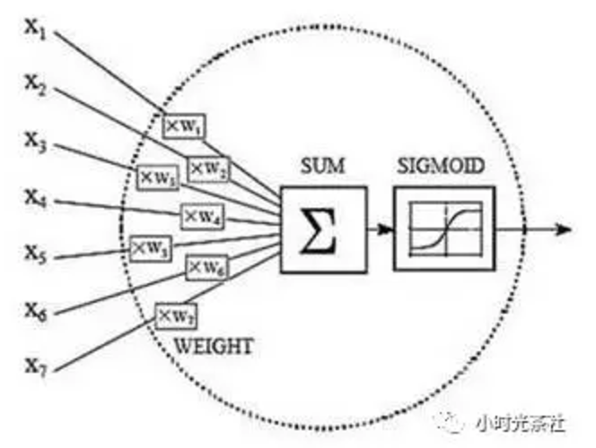

通过借鉴和参考神经元的机制，科学家们模拟出了人工神经元和人工神经网络。当然，通过上述这个抽象的描述和图，比较难让大家理解它的机制和原理。我们以“房屋价格测算”作为例子，一起来看看：

一套房子的价格，会受到很多因素的影响，例如地段、朝向、房龄、面积、银行利率等等，这些因素如果细分，可能会有几十个。一般在深度学习模型里，这些影响结果的因素我们称之为特征。我们先假设一种极端的场景，例如影响价格的特征只有一种，就是房子面积。于是我们收集一批相关的数据，例如，50平米50万、93平米95万等一系列样本数据，如果将这些样本数据放到而为坐标里看，则如下图：


然后，正如我们前面所说的，我们尝试用一个“函数”去拟合这个输入（面积x）和输出（价格y），简而言之，我们就是要通过一条直线或者曲线将这些点“拟合”起来。

假设情况也比较极端，这些点刚好可以用一条“直线”拟合（真实情况通常不会是直线），如下图：

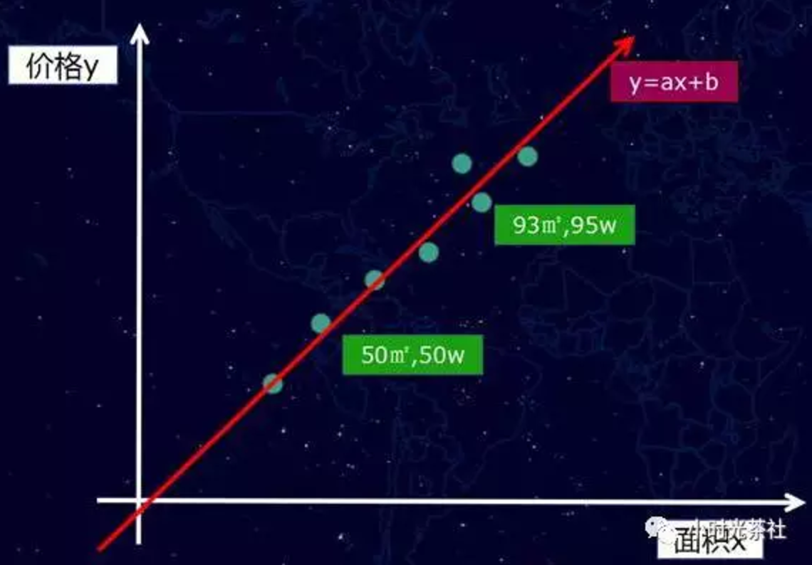

那么我们的函数是一个一次元方程f(x) = ax +b，当然，如果是曲线的话，我们得到的将是多次元方程。我们获得这个f(x) = ax +b的函数之后，接下来就可以做房价“预测”，例如，我们可以计算一个我们从未看见的面积案例81.5平方米，它究竟是多少钱？

这个新的样本案例，可以通过直线找到对应的点（黄色的点），如图下：

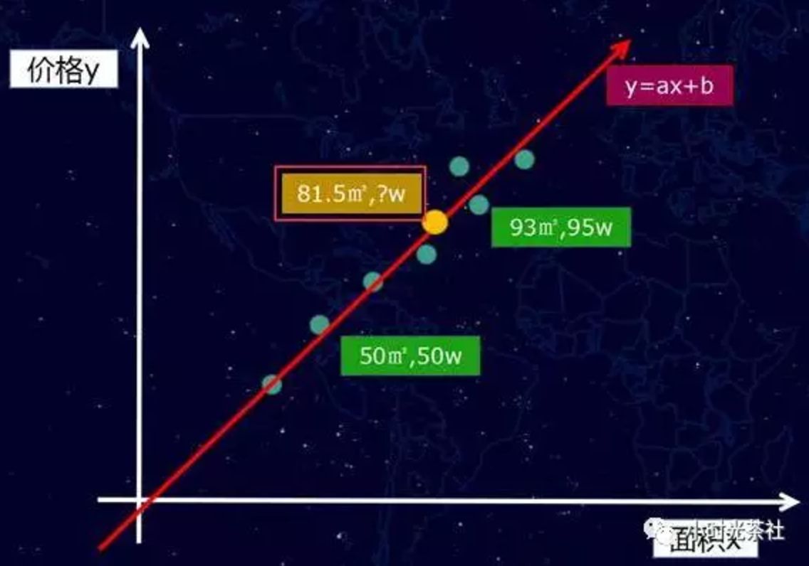

粗略的理解，上面就是AI的概括性的运作方式。这一切似乎显得过于简单了？当然不会，因为，我们前面提到，影响房价其实远不止一个特征，而是有几十个，这样问题就比较复杂了，接下来，这里则要继续介绍深度学习模型的训练方式。这部分内容相对复杂一点，我尽量以业务工程师的视角来做一个粗略而简单的阐述。

### 3. 深度学习模型的训练方式

当有好几十个特征共同影响价格的时候，自然就会涉及权重分配的问题，例如有一些对房价是主要正权重的，例如地段、面积等，也有一些是负权重的，例如房龄等。

（1）初始化权重计算

那么，第一个步其实是给这些特征加一个权重值，但是，最开始我们根本不知道这些权重值是多少？怎么办呢？不管那么多了，先给它们随机赋值吧。随机赋值，最终计算出来的估算房价肯定是不准确的，例如，它可能将价值100万的房子，计算成了10万。

（2）损失函数

因为现在模型的估值和实际估值差距比较大，于是，我们需要引入一个评估“不准确”程度的衡量角色，也就是损失（loss）函数，它是衡量模型估算值和真实值差距的标准，损失函数越小，则模型的估算值和真实值的察觉越小，而我们的根本目的，就是降低这个损失函数。让刚刚的房子特征的模型估算值，逼近100万的估算结果。

（3）模型调整

通过梯度下降和反向传播，计算出朝着降低损失函数的方向调整权重参数。举一个不恰当的比喻，我们给面积增加一些权重，然后给房子朝向减少一些权重（实际计算方式，并非针对单个个例特征的调整），然后损失函数就变小了。

（4）循环迭代

调整了模型的权重之后，就可以又重新取一批新的样本数据，重复前面的步骤，经过几十万次甚至更多的训练次数，最终估算模型的估算值逼近了真实值结果，这个模型的则是我们要的“函数”。

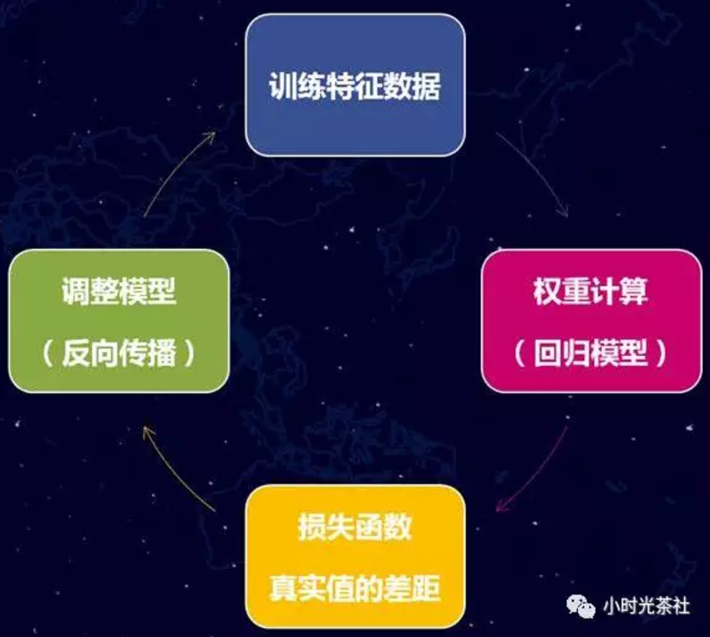

为了让大家更容易理解和直观，采用的例子比较粗略，并且讲述深度学习模型的训练过程，中间省略了比较多的细节。讲完了原理，那么我们就开始讲讲如何学习和搭建demo。

### 三、深度学习环境搭建

在2个月前，人工智能对我来说，只是一个高大上的概念。但是，经过一个多月的业余时间的认真学习，我发现还是能够学到一些东西，并且跑一些demo和应用出来的。

**1. 学习的提前准备**

（1）部分数学内容的复习，高中数学、概率、线性代数等部分内容。（累计花费了10个小时，挑了关键的点看了下，其实还是不太够，只能让自己看公式的时候，相对没有那么懵）

（2）Python基础语法学习。（花费了3个小时左右，我以前从未写过Python，因为后面Google的TensorFlow框架的使用是基于Python的）

（3）Google的TensorFlow深度学习开源框架。（花费了10多个小时去看）

数学基础好或者前期先不关注原理的同学，数学部分不看也可以开始做，全凭个人选择。

**2. Google的TensorFlow开源深度学习框架**

深度学习框架，我们可以粗略的理解为是一个“数学函数”集合和AI训练学习的执行框架。通过它，我们能够更好的将AI的模型运行和维护起来。

深度学习的框架有各种各样的版本（Caffe、Torch、Theano等等），我只接触了Google的TensorFlow，因此，后面的内容都是基于TensorFlow展开的，它的详细介绍这里不展开讲述，建议直接进入官网查看。非常令人庆幸的是TensorFlow比较早就有中文社区了，尽管里面的内容有一点老，搭建环境方面有一些坑，但是已经属于为数不多的中文文档了，大家且看且珍惜。

[TensorFlow 的中文社区](http://www.tensorfly.cn/)

[TensorFlow 的英文社区](https://www.tensorflow.org/)

**3. TensorFlow环境搭建**

环境搭建本身并不复杂，主要解决相关的依赖。但是，基础库的依赖可以带来很多问题，因此，建议尽量一步到位，会简单很多。

**（1）操作系统**

我搭建环境使用的机器是腾讯云上的机器，软件环境如下：

操作系统：CentOS 7.2 64位（GCC 4.8.5）

因为这个框架依赖于python2.7和glibc 2.17。比较旧的版本的CentOS一般都是python2.6以及版本比较低的glibc，会产生比较的多基础库依赖问题。而且，glibc作为Linux的底层库，牵一发动全身，直接对它升级是比较复杂，很可能会带来更多的环境异常问题。

**（2）软件环境**

我目前安装的Python版本是python-2.7.5，建议可以采用yum install python的方式安装相关的原来软件。然后，再安装 python内的组件包管理器pip，安装好pip之后，接下来的其他软件的安装就相对比较简单了。

例如安装TensorFlow，可通过如下一句命令完成（它会自动帮忙解决一些库依赖问题）：

```
pip install -U tensorflow

```

这里需要特别注意的是，不要按照TensorFlow的中文社区的指引去安装，因为它会安装一个非常老的版本（0.5.0），用这个版本跑很多demo都会遇到问题的。而实际上，目前通过上述提供的命令安装，是tensorflow (1.0.0)的版本了。

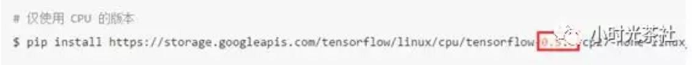

Python（2.7.5）下的其他需要安装的关键组件：

- tensorflow (0.12.1)，深度学习的核心框架
- image (1.5.5)，图像处理相关，部分例子会用到
- PIL (1.1.7)，图像处理相关，部分例子会用到

除此之后，当然还有另外的一些依赖组件，通过pip list命令可以查看我们安装的python组件：

- appdirs (1.4.0)
- backports.ssl-match-hostname (3.4.0.2)
- chardet (2.2.1)
- configobj (4.7.2)
- decorator (3.4.0)
- Django (1.10.4)
- funcsigs (1.0.2)
- image (1.5.5)
- iniparse (0.4)
- kitchen (1.1.1)
- langtable (0.0.31)
- mock (2.0.0)
- numpy (1.12.0)
- packaging (16.8)
- pbr (1.10.0)
- perf (0.1)
- PIL (1.1.7)
- Pillow (3.4.2)
- pip (9.0.1)
- protobuf (3.2.0)
- pycurl (7.19.0)
- pygobject (3.14.0)
- pygpgme (0.3)
- pyliblzma (0.5.3)
- pyparsing (2.1.10)
- python-augeas (0.5.0)
- python-dmidecode (3.10.13)
- pyudev (0.15)
- pyxattr (0.5.1)
- setuptools (34.2.0)
- six (1.10.0)
- slip (0.4.0)
- slip.dbus (0.4.0)
- tensorflow (1.0.0)
- urlgrabber (3.10)
- wheel (0.29.0)
- yum-langpacks (0.4.2)
- yum-metadata-parser (1.1.4)

按照上述提供的来搭建系统，可以规避不少的环境问题。

搭建环境的过程中，我遇到不少问题。例如：在跑官方的例子时的某个报错，AttributeError: 'module' object has no attribute 'gfile'，就是因为安装的TensorFlow的版本比较老，缺少gfile模块导致的。而且，还有各种各样的。（不要问我是怎么知道的，说多了都是泪啊~）

更详细的安装说明：[Installing TensorFlow on Ubuntu](https://www.tensorflow.org/install/install_linux)

**（3）TensorFlow环境测试运行**

测试是否安装成功，可以采用官方的提供的一个短小的例子，demo生成了一些三维数据, 然后用一个平面拟合它们（官网的例子采用的初始化变量的函数是initialize_all_variables，该函数在新版本里已经被废弃了）：

```
#!/usr/bin/python
#coding=utf-8

import tensorflow as tf
import numpy as np

# 使用 NumPy 生成假数据(phony data), 总共 100 个点.
x_data = np.float32(np.random.rand(2, 100)) # 随机输入
y_data = np.dot([0.100, 0.200], x_data) + 0.300

# 构造一个线性模型
# 
b = tf.Variable(tf.zeros([1]))
W = tf.Variable(tf.random_uniform([1, 2], -1.0, 1.0))
y = tf.matmul(W, x_data) + b

# 最小化方差
loss = tf.reduce_mean(tf.square(y - y_data))
optimizer = tf.train.GradientDescentOptimizer(0.5)
train = optimizer.minimize(loss)

# 初始化变量,旧函数（initialize_all_variables）已经被废弃，替换为新函数
init = tf.global_variables_initializer()

# 启动图 (graph)
sess = tf.Session()
sess.run(init)

# 拟合平面
for step in xrange(0, 201):
    sess.run(train)
    if step % 20 == 0:
        print step, sess.run(W), sess.run(b)

# 得到最佳拟合结果 W: [[0.100  0.200]], b: [0.300]

```

运行的结果类似如下：

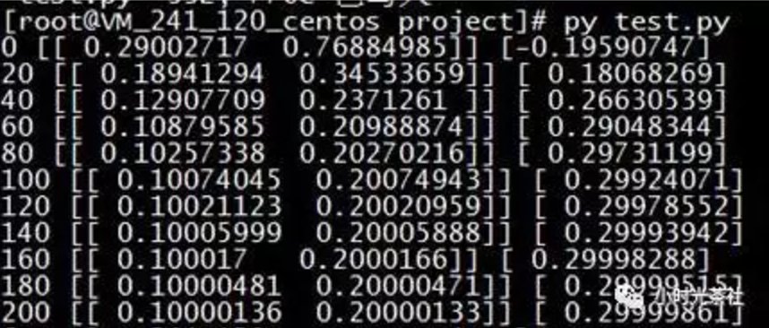

经过200次的训练，模型的参数逐渐逼近最佳拟合的结果（W: [[0.100 0.200]], b: [0.300]），另外，我们也可以从代码的“风格”中，了解到框架样本训练的基本运行方式。虽然，官方的教程后续会涉及越来越多更复杂的例子，但从整体上看，也是类似的模式。


**步骤划分**

- 准备数据：获得有标签的样本数据（带标签的训练数据称为有监督学习）；
- 设置模型：先构建好需要使用的训练模型，可供选择的机器学习方法其实也挺多的，换而言之就是一堆数学函数的集合；
  损失函数和优化方式：衡量模型计算结果和真实标签值的差距；
- 真实训练运算：训练之前构造好的模型，让程序通过循环训练和学习，获得最终我们需要的结果“参数”；
- 验证结果：采用之前模型没有训练过的测试集数据，去验证模型的准确率。

其中，TensorFlow为了基于python实现高效的数学计算，通常会使用到一些基础的函数库，例如Numpy（采用外部底层语言实现），但是，从外部计算切回到python也是存在开销的，尤其是在几万几十万次的训练过程。因此，Tensorflow不单独地运行单一的函数计算，而是先用图描述一系列可交互的计算操作流程，然后全部一次性提交到外部运行（在其他机器学习的库里，也是类似的实现）。

所以，上述流程图中，蓝色部分都只是设置了“计算操作流程”，而绿色部分开始才是真正的提交数据给到底层库进行实际运算，而且，每次训练一般是批量执行一批数据的。
