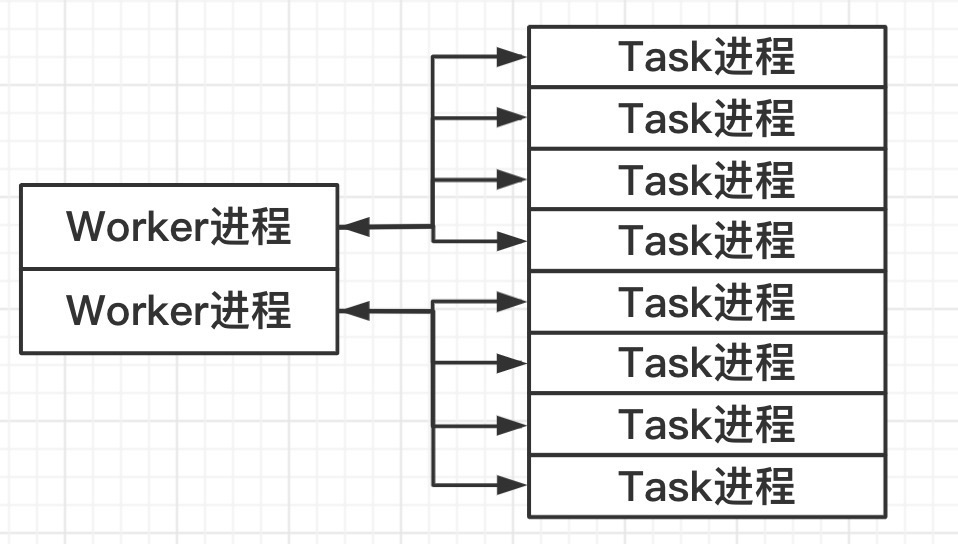
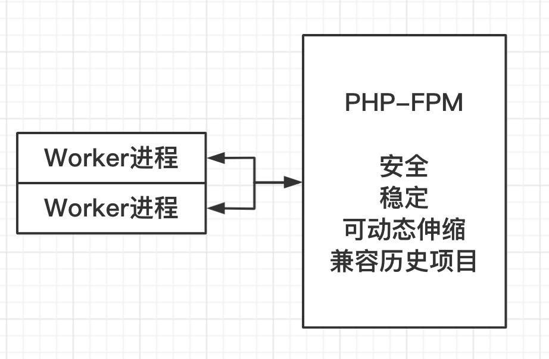
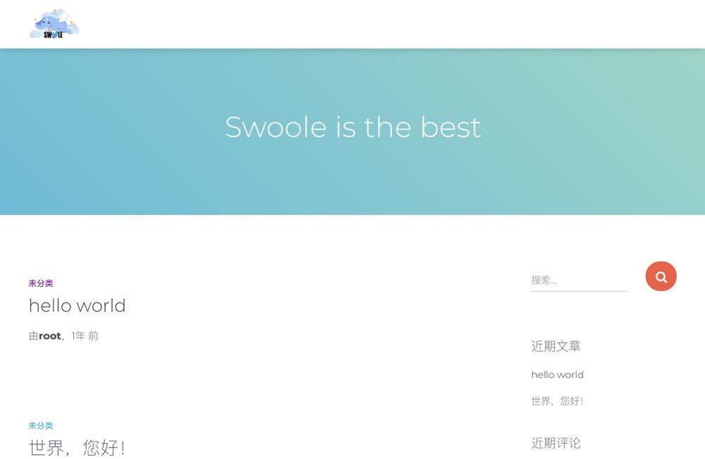
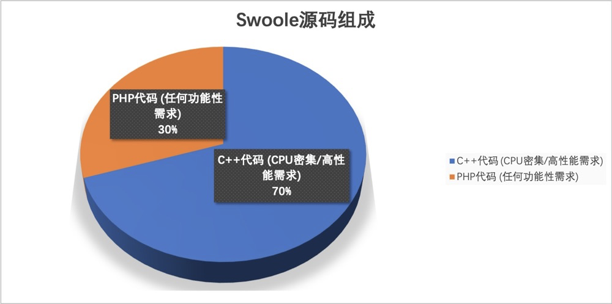

> 作者：陈曹奇昊
>
> 首发于公众号: 学而思网校技术团队

一丶 什么是FastCGI

在Swoole最新发布的v4.5(RC)版本中，我们实现了一项非常有意思的新特性，那就是协程版本的FastCGI客户端。

那么什么是FastCGI呢？首先先来一个官方解释：

>**快速通用网关接口**（**Fast** **C**ommon **G**ateway **I**nterface／**FastCGI**）是一种让交互程序与Web服务器通信的协议。

其实很简单，大家使用PHP-FPM搭建服务的时候必然少不了前面架一个Nginx丶Apache或者IIS之类的东西作为代理，我们应用程序和代理通信的时候，可能会使用各种各样的协议（常见的比如浏览器使用的是HTTP/1.1，HTTP2，QUIC等），而代理的职责就是把各种协议的请求翻译成FastCGI来和PHP-FPM通信，这样PHP服务就无需关心各种类型协议的解析，而可以只关心处理请求本身的内容，且FastCGI是二进制协议，相较于HTTP1.x这样的文本协议，FastCGI可以说是非常高效。

实现了FastCGI客户端，那么我们就可以直接与PHP-FPM服务进行交互，但是这有什么用呢？

<!--more-->

二丶Swoole中的Task进程

在一个Swoole的异步/协程服务中，我们无法容忍任何阻塞的存在，只要有一处调用阻塞，那么整个服务程序都会退化为阻塞程序，而此时如果我们又没有太多的资源去重构老项目，我们通常会选择使用Task进程来解决。

Task进程是Swoole异步服务器中专门设计用来执行同步阻塞程序的工作进程，我们可以很方便地调用`$server->task`方法去投递一个同步阻塞任务给Task进程并立即返回，Task进程在完成后再通知Worker进程接收结果，这样就构成了一个半异步半同步的服务器。

> 我们需要大量的task进程来处理少量的同步阻塞任务，但只需要少量的Worker就可以处理大量的异步非阻塞任务，这就是多路IO复用技术带来的好处



虽然这样看起来已经非常方便了，但还是有一些不足，如：很多项目不单是同步阻塞，还只能运行在PHP-FPM语境下；此外，如果是协程服务器或是自己用socket写的服务器，就无法使用task功能。那么这时候协程版本的FastCGI就可以一展身手了。


三、使用协程FastCGI客户端调用PHP-FPM程序

首先我们本地得有一个正在运行的PHP-FPM，默认配置，知道它的地址即可

然后我们写一个世界级的Hello程序，存档为`/tmp/greeter.php`，我们只需在命令行中输入：

```shell
echo "<?php echo 'Hello ' . (\$_POST['who'] ?? 'World');" > /tmp/greeter.php
```

然后我们得确保我们已经安装了Swoole扩展，这时候我们只需要在命令行输入：

```php
php -n -dextension=swoole -r \
"Co\run(function() { \
     echo Co\FastCGI\Client::call('127.0.0.1:9000', '/tmp/greeter.php',  ['who' => 'Swoole']); \
});"
```

就能得到输出

```shell
Hello Swoole
```

这样一个最简单的调用就完成了，并且是协程非阻塞的，我们甚至可以通过多个客户端并发调用多个PHP-FPM提供的接口再提供给前端以提高响应速度。

我们可以先写一个sleep程序来模拟同步阻塞的PHP-FPM应用：

```php
<?php #blocking.php
sleep(1);
echo $_POST['id'] . PHP_EOL;
```

协程FastCGI支持了PSR风格（并非规范）的操作方法，我们也可以自己手动构造一个HTTP请求传入，籍此我们可以灵活地构造任意FastCGI请求和PHP-FPM程序交互：

```php
use Swoole\Coroutine;
use Swoole\Coroutine\FastCGI\Client;
use Swoole\FastCGI\HttpRequest;

$s = microtime(true);
Coroutine\run(function () {
    for ($n = 0; $n < 2; $n++) {
        Co::create(function () use ($n) {
            try {
                $client = new Client('127.0.0.1', 9000);
                $request = (new HttpRequest())
                    ->withScriptFilename('/path/to/blocking.php')
                    ->withMethod('POST')
                    ->withBody(['id' => $n]);
                $response = $client->execute($request);
                echo "Result: {$response->getBody()}\n";
            } catch (Client\Exception $exception) {
                echo "Error: {$exception->getMessage()}\n";
            }
        });
    }
});
$s = microtime(true) - $s;
echo 'use ' . $s . ' s' . "\n";
```

最终程序输出可能是：

```php
Result: 1
Result: 0
use 1.0145659446716 s
```

可以看到我们并发请求两个阻塞1s的接口，而总耗时仅需1s（实际上是`MAX(...所有接口响应时间)`），而且我们可以看到先请求不一定先返回，这同样也证明了这是一个非阻塞的程序。

当然这里要注意的是，你能并发的数量取决于你机器上PHP-FPM的工作进程数量，如果工作进程数量不足，那么请求不得不进行排队。

协程FastCGI客户端的到来，相当于我们的协程应用现在拥有了PHP-FPM这样一个无比强大稳定的进程管理器作为Task进程池来完成同步阻塞任务，借此我们可以解决很多问题，如：

有一些协议暂未受到Swoole协程的支持，但却有可用的同步阻塞的版本（MongoDB、sqlserver等），我们就可以通过它放心地投递给PHP-FPM来完成。

或是你有一个很老的PHP-FPM项目饱受性能困扰又因积重难返而无法快速重构，我们还是可以借助它来更平滑地将旧业务迁移到新的异步/协程服务器中。




四丶使用协程FastCGI一键代理WordPress

最强大的是协程FastCGI客户端还支持**一键代理功能**，可以将其它HTTP请求对象转化为FastCGI请求（目前只支持了Swoole\Http，后续可能加入PSR支持），也可以将FastCGI响应转化为HTTP响应，基于这个特性，我们可以做到代理世界上最好的博客程序：

```php
declare(strict_types=1);

use Swoole\Constant;
use Swoole\Coroutine\FastCGI\Proxy;
use Swoole\Http\Request;
use Swoole\Http\Response;
use Swoole\Http\Server;

$documentRoot = '/path/to/wordpress'; // WordPress目录的绝对路径
$server = new Server('0.0.0.0', 80, SWOOLE_BASE);
$server->set([
    Constant::OPTION_WORKER_NUM => swoole_cpu_num() * 2,
    Constant::OPTION_HTTP_PARSE_COOKIE => false,
    Constant::OPTION_HTTP_PARSE_POST => false,
    Constant::OPTION_DOCUMENT_ROOT => $documentRoot,
    Constant::OPTION_ENABLE_STATIC_HANDLER => true,
    Constant::OPTION_STATIC_HANDLER_LOCATIONS => ['/'],
]);
$proxy = new Proxy('127.0.0.1:9000', $documentRoot);
$server->on('request', function (Request $request, Response $response) use ($proxy) {
    $proxy->pass($request, $response);
});
$server->start();

```

撇开一些配置项的设置，整个代理的核心提取出来其实就只有这样一句代码

```php
(new Proxy('127.0.0.1:9000', $documentRoot))->pass($request, $response);
```

然后我们就可以在浏览器中访问localhost：

> 图示为本地已搭建好的WordPress站点




五丶协程FastCGI客户端的背后

协程FastCGI客户端，我们可以在 https://github.com/swoole/library 仓库查看它的源码，在README中可以找到现成的Docker构建命令和配套演示程序来让我们快速上手体验它。

此外，通过查看源码我们不难发现，协程FastCGI客户端是完全使用PHP代码编写、基于协程Socket实现的，由于FastCGI是高效的二进制协议，我们使用PHP代码来进行解析也不会有太大的开销（而HTTP1.x这样的文本协议就不行，越是人类友好的协议，对机器来说就越不友好）。

包括很多Swoole的其它组件如：WaitGroup、全自动连接池、协程Server等等，都是使用PHP编写的，PHP编写的组件具有内存安全、开发高效的特点，并且Swoole内核将这些PHP组件内嵌到了扩展中，开发者是无感知的，安装扩展后就能立即使用这些组件而无需引入额外的包管理。

即使FastCGI客户端是纯PHP编写的，压测性能和nginx仍在一个量级，这也证明了PHP的性能瓶颈并不总是在于PHP代码本身，很多时候是由于同步阻塞的IO模型导致的。



目前PHP编写的组件在Swoole中的占比还不高，未来我们希望能引入更多的PHP编写的内部组件来解决功能性的需求，而只有PHP难以满足的一些高性能的需求（如各种复杂协议的处理）才考虑使用C++实现。

